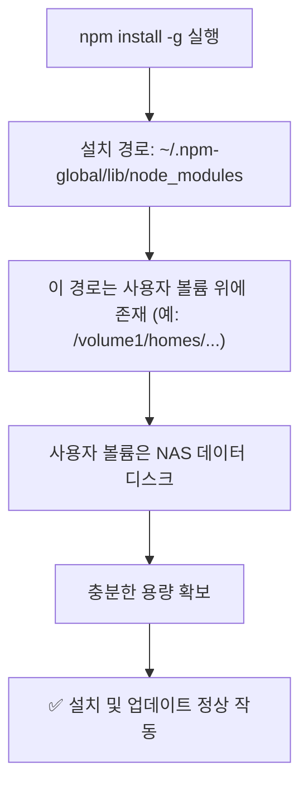
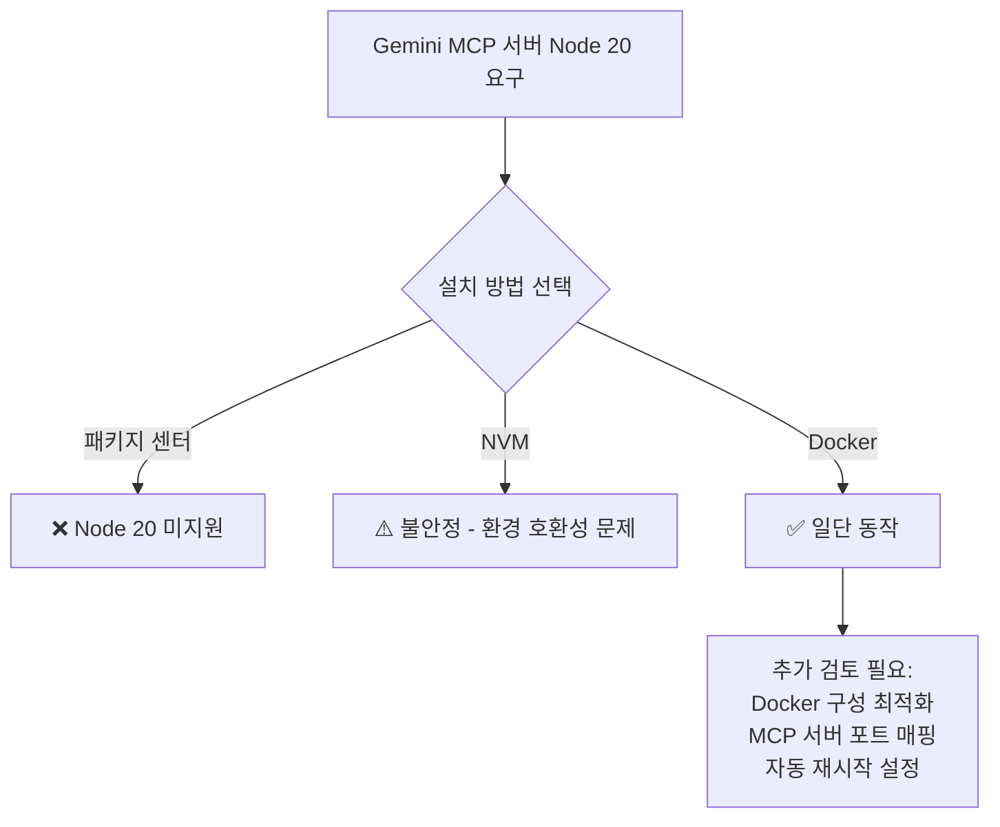
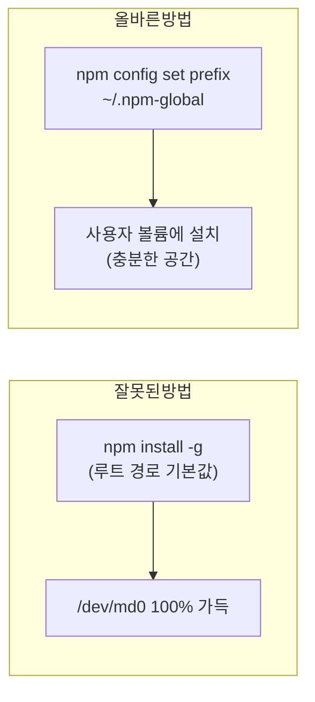

## 배경

Synology NAS에서 Node.js 기반 MCP 서버(Claude, Gemini 등)를 운영하다가 업데이트가 전혀 안 되는 상황이 발생했다. 원인을 추적해보니 두 가지 문제가 복합적으로 얽혀 있었다.

---

## 문제 1 — `/dev/md0` 루트 파티션 용량 부족

### 증상

- `npm install -g` 실패
- 패키지 업데이트 불가
- NAS 패키지 센터에서 앱 설치/업데이트 오류

### 원인

Synology DSM의 시스템 파티션(`/dev/md0`)은 기본적으로 **2GB 내외**로 매우 작다.
npm 글로벌 패키지 기본 설치 경로는 `/usr/local/lib/node_modules`인데, 이 경로가 `/dev/md0` 위에 있다.

특히 `@google/generative-ai` 같은 Google 관련 패키지는 용량이 상당히 커서 루트 파티션을 빠르게 채운다.

```bash
# 용량 확인
df -h

# 출력 예시:
# Filesystem      Size  Used Avail Use%  Mounted on
# /dev/md0        2.0G  2.0G    0  100% /
```

### 문제 구조

```mermaid
flowchart TD
    A[npm install -g 실행] --> B[설치 경로: /usr/local/lib/node_modules]
    B --> C[이 경로는 /dev/md0 위에 존재]
    C --> D[/dev/md0 는 Synology 시스템 파티션]
    D --> E[기본 용량 약 2GB]
    E --> F[@google/* 등 대용량 패키지 설치 시 100% 도달]
    F --> G[❌ 모든 npm 설치/업데이트 실패]
```

---

## 해결 1 — npm 글로벌 패키지 경로를 사용자 홈으로 이동

### 절차

#### 1단계: 새 글로벌 경로 디렉토리 생성

```bash
mkdir -p ~/.npm-global
```

#### 2단계: npm prefix 변경

```bash
npm config set prefix ~/.npm-global
```

설정 확인:

```bash
npm config get prefix
# 출력: /var/services/homes/username/.npm-global
```

#### 3단계: PATH에 추가

`~/.bashrc` 또는 `~/.profile`에 아래 줄 추가:

```bash
export PATH="$HOME/.npm-global/bin:$PATH"
```

적용:

```bash
source ~/.bashrc
```

#### 4단계: 새 경로 확인

```bash
npm root -g
# 출력: /var/services/homes/username/.npm-global/lib/node_modules
```

#### 5단계: 기존 글로벌 패키지 정리 (선택)

기존 경로의 패키지는 자동 이전되지 않는다. 필요한 것만 새 경로에 재설치한다.

```bash
# 현재 글로벌 패키지 목록 확인
npm list -g --depth=0

# 필요한 패키지 재설치
npm install -g <package-name>
```

#### 기존 대용량 패키지 삭제 (중요 — 반드시 수행)

경로를 바꿨다고 끝이 아니다. 기존 `/usr/local/lib/node_modules`에 남아있는 대용량 패키지를 삭제해야 `/dev/md0` 공간이 실제로 확보된다.

**용량 확인부터:**

```bash
# @google 전체 용량
du -sh /usr/local/lib/node_modules/@google

# 내부 패키지별 용량
du -sh /usr/local/lib/node_modules/@google/*
```

**방법 1: npm uninstall로 안전하게 삭제 (추천)**

```bash
# 현재 글로벌 설치된 @google 패키지 확인
npm list -g --depth=0 | grep @google

# 개별 삭제
npm uninstall -g @google/generative-ai
npm uninstall -g @google-cloud/sdk

# 또는 일괄 삭제
npm list -g --depth=0 | grep '@google/' | awk '{print $2}' | xargs npm uninstall -g
```

이 방법이 가장 안전하다. npm registry 상태가 유지되고, 글로벌 바이너리도 정상적으로 정리된다.

**방법 2: 강제 폴더 삭제 (긴급 시)**

용량이 정말 급하면 직접 삭제도 가능하지만 부작용이 있다:

```bash
sudo rm -rf /usr/local/lib/node_modules/@google
```

부작용:
- `npm list -g` 출력이 꼬일 수 있음
- 글로벌 바이너리 링크가 깨질 수 있음

반드시 후속 정리를 해야 한다:

```bash
npm cache clean --force
npm doctor
```

**장기 전략:**

글로벌 설치 자체를 최소화하는 것이 근본적인 해결책이다.

```bash
# 글로벌 설치 대신 npx로 실행
npx @google/generative-ai ...

# 또는 Docker 컨테이너 내에서 실행
docker run -it node:20 npm install ...
```

### 해결 후 구조



---

## 문제 2 — Gemini MCP 서버가 Node.js 20을 요구하는데 Synology DSM 7.2에서 설치 불가

### 증상

- `@google/generative-ai` 최신 버전 업데이트 후 서버가 Node 20 이상을 요구함
- Synology 패키지 센터에서 제공하는 Node.js는 버전 20 미제공 (DSM 7.2 기준)

### 시도한 방법들

| 방법 | 결과 | 비고 |
|---|---|---|
| Synology 패키지 센터 | ❌ Node 18까지만 제공 | DSM 7.2 기준 |
| NVM으로 Node 20 설치 | ⚠️ 설치는 되나 불안정 | Synology 환경 호환성 문제 |
| Docker 컨테이너로 분리 | ✅ 동작하나 구성 복잡 | 추가 확인 필요 |

### 현재 상태 및 향후 과제



Docker로 Node 20 환경에서 MCP 서버를 실행하는 방법은 아직 확인 중이며, 올바른 구성이 완료되면 별도 포스트로 정리할 예정이다.

---

## 핵심 교훈 요약



| 항목 | 잘못된 방법 | 올바른 방법 |
|---|---|---|
| npm 글로벌 경로 | `/usr/local/lib/node_modules` (루트) | `~/.npm-global` (사용자 볼륨) |
| Node 버전 관리 | 패키지 센터에만 의존 | NVM 또는 Docker 활용 |
| 대용량 패키지 | 글로벌 설치 | npx 또는 로컬 설치 권장 |
| sudo 필요 여부 | 필요 | 불필요 (사용자 경로이므로) |

---

## 주의사항

### npm prefix 변경은 패키지 설치 경로만 바꾼다

`npm config set prefix`는 **npm 글로벌 패키지 설치 경로**만 변경한다. `node` 실행 파일 자체의 위치는 변경되지 않는다.

| 대상 | 변경 여부 |
|---|---|
| `node` 바이너리 | ❌ 기존 위치 유지 |
| `npm -g install` 결과물 | ✅ 새 prefix 경로로 이동 |
| 글로벌 bin 링크 | ✅ `~/.npm-global/bin/`으로 이동 |

### 기존 패키지는 자동 이전되지 않는다

경로를 바꾼 후 기존 `/usr/local/lib/node_modules`에 있던 패키지가 새 경로로 자동으로 옮겨지지 않는다. 필요한 패키지는 새 경로에서 다시 설치해야 한다.

```bash
# 기존 패키지 목록 백업
npm list -g --depth=0 > ~/npm-global-backup.txt

# 새 경로에서 필요한 것만 재설치
npm install -g typescript
npm install -g pnpm
```

### 같이 확인하면 좋은 것

```bash
# 현재 글로벌 bin 경로
npm bin -g

# 현재 prefix
npm prefix -g
```

---

## 빠른 명령어 참조

```bash
# 현재 npm 글로벌 경로 확인
npm config get prefix
npm root -g

# 루트 파티션 사용량 확인
df -h /

# 글로벌 패키지 용량 분석
du -sh /usr/local/lib/node_modules/*

# npm 글로벌 경로 변경 (원라인)
mkdir -p ~/.npm-global && npm config set prefix ~/.npm-global
echo 'export PATH="$HOME/.npm-global/bin:$PATH"' >> ~/.bashrc && source ~/.bashrc
```

---

## 참고

- [NAS 남은 공간 부족 에러: dev/md0 100% 사용문제 해결](https://mhseecom.tistory.com/935)
- Synology DSM 7.2 기준 작성 (2026-03)
